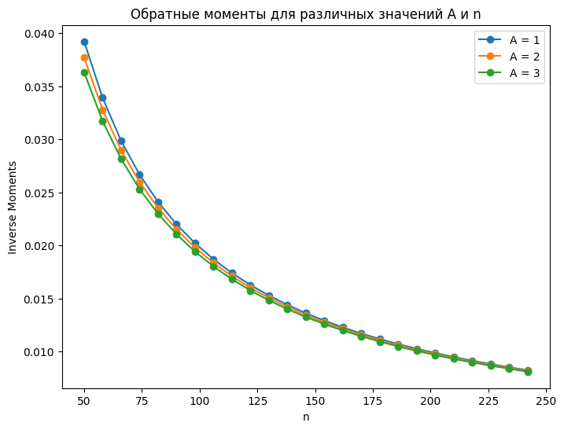
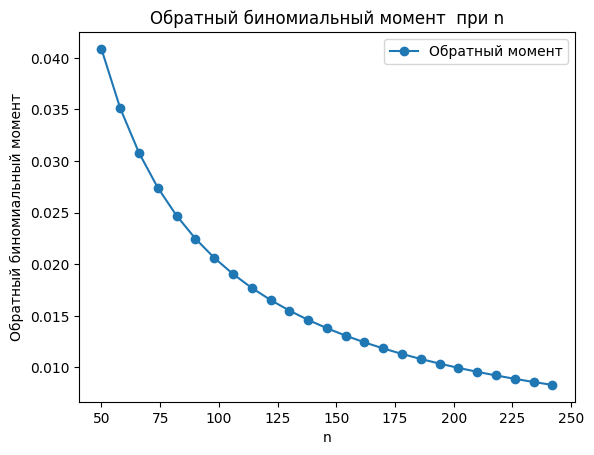
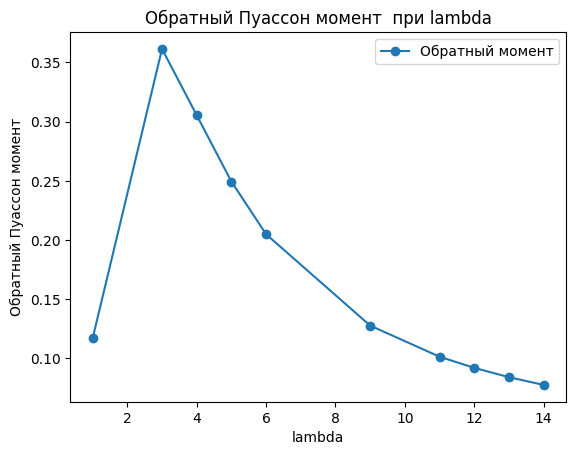
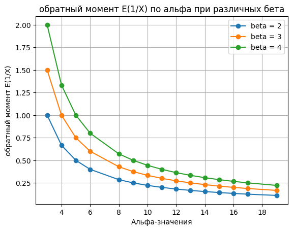
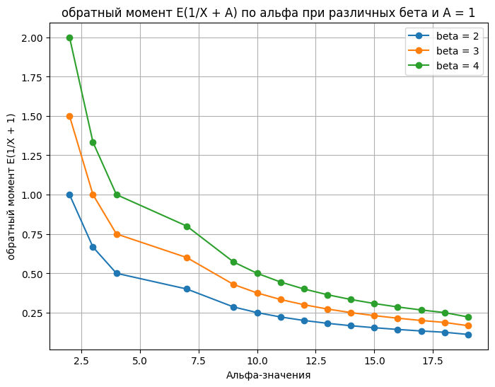

# <span style="font-family:'Times New Roman'; color:lightblue; text-align:center;">Master-Degree-Project</span>

# <span style="font-family: 'Times new roman', sans-serif; color:Red">Method of Negative Moments of Positive Random Variables</span>

<span style="font-family:'Time new Roman'">
Recent experiments on the lifespan of products focus on measuring reliability characteristics by testing identical components under normal conditions and recording their "time to failure." This time is considered a random variable with a specific cumulative distribution function (CDF). The inverse moment of a positive random variable is used to estimate the lifespan and understand the distribution of failure times. Significant inverse moments can indicate a higher likelihood of early failures, providing valuable information for product design and reliability assessment.

This thesis consists of three chapters:
1. **Theoretical Overview**: It explains statistical moments, their use in data analysis, and the formal definition and role of the inverse moment in characterizing distributions, compared to other moments like mean and variance.
2. **Interpretation of the Inverse Moment**: It explores how the inverse moment helps interpret data, its relationship with the distribution shape (skewness), and examples in different contexts.
3. **Analysis in Various Distributions**: This chapter analyzes the inverse moment in several distributions, its effect on skewed distributions, and provides practical examples.

The use of negative moments is important for understanding the behavior of random variables, especially in assessing the likelihood of extreme events, such as early failures or short lifespans. Negative moments help characterize the tail behavior of distributions, providing insights into the reliability and risk of systems. They are particularly useful in fields like:

- **Reliability and Risk Analysis**: Assessing product lifespans, system failures, and maintenance schedules.
- **Life Testing**: Estimating failure times in various products or systems.
- **Survival Analysis**: Analyzing time-to-event data in medical and healthcare settings.
- **Finance and Insurance**: Evaluating large losses and assessing financial risks.

Negative moments are essential for making informed decisions in engineering, healthcare, finance, and other industries where predicting failure or assessing risk is critical.</span>

## Objectif of the Master Thesis

This thesis explores the calculation of inverse moments of random variables under various statistical distributions (discrete and continuous). The goal is to derive and analyze these moments through analytical and computational approaches, emphasizing their application in life testing and reliability analysis.

## Definition 
The **negative moment** of a random variable $ X $ refers to the expected value of the random variable raised to a negative power. Specifically, the negative $( k )-th$ moment of a random variable $ X $ is defined as:

$$
E[X^{-k}] = \int_{-\infty}^{\infty} x^{-k} f_X(x) \, dx
$$

where:
- $ E[X^{-k}]$ is the expected value of $ X^{-k} $,
- $ $X(x)$ is the probability density function (PDF) of the random variable $ X $,
- $ k $ is a positive integer, indicating the order of the negative moment.

### Intuition:
Negative moments provide information about the tail behavior of a distribution, especially in contexts where extreme values are important. For instance:
- In reliability analysis, negative moments can help assess the likelihood of early failures or unusual events.
- They are also related to the **asymmetry** of the distribution (skewness), providing insights into the shape of the distribution, particularly its left tail.

### Example:
For a positive random variable $ X $, such as a **Weibull** distribution, you might calculate the negative moment to assess how quickly the probability of failure increases (for example, failures that occur earlier than expected).

The **first negative moment** $E[X^{-1}]$ is especially important when studying systems where the probability of failure increases rapidly over time.

### Use in Life Testing:
In life testing or reliability analysis, the negative moment can be used to understand and predict the time until failure, especially when you are concerned about the early or extreme failures of products or systems.

## ### Final Work Summary: 

**"Methods for Calculating Inverse Moments of Non-Negative Random Variables"**
---

#### **Methods:**
1. **Theoretical Foundations:**
   - Explanation of statistical moments and their applications in data analysis.
   - Definition of inverse moments as $E[X^{-1}]$, including generalizations in the form $E[(X + A)^{-1}]$.

2. **Analytical Techniques:**
   - Formulated conditions for the existence of inverse moments.
   - Provided methods for deriving inverse moments from both discrete (e.g., binomial, Poisson) and continuous (e.g., gamma, beta) distributions.

3. **Computational Implementation:**
   - Developed Python programs to calculate and analyze inverse moments.
   - Demonstrated the numerical methods through simulations, showcasing graphical and tabular results.

4. **Numerical Methods for Specific Distributions:**
   - Derived inverse moments for various distributions:
     - **Discrete**: Generalized geometric, binomial, and Poisson distributions.
     - **Continuous**: Gamma and beta distributions.
   - Illustrated these through step-by-step calculations and practical examples.

---

#### **Results:**
1. **Inverse Moments Analysis:**
   - Successfully computed and validated inverse moments for various distributions.
   - Highlighted the utility of inverse moments in analyzing the asymmetry and reliability characteristics of random variables.

2. **Practical Applications:**
   - Demonstrated the role of inverse moments in life testing, particularly in assessing the time to failure of systems or components.
  # - Generalized geometric random variable with inverse moment
Some pratical example of the uses of GGRVIM.
### Example:

Consider the important problem of estimating the probability of success for a negative binomial distribution. In this familiar situation, let us denote the random number of trials required to achieve a fixed number of $r$ successful trials. Let $p$ be the probability of success in any trial. Then, the random number of observed failures is given by $X \sim NB(r,p)$.

The probability mass function of the negative binomial distribution is:

$$
f(k, r, p) \equiv Pr(X=k) = \binom{k+r-1}{k}(1-p)^{k}p^{r}.
$$

Thus, the moment generating function is given by:

$$
M_{X}(t) = E\big[e^{tX}\big] = \left(\frac{p}{1-qe^{t}}\right)^{r} = \left(\frac{p}{1-(1-p)e^{t}}\right)^{r}, \quad -\log q < t < \infty
$$

where $q = 1 - p$. The first negative moment of the negative binomial distribution can be directly obtained using the formula \[ \ref{eq:1} \], by substituting the value of the moment generating function $M_{x}(t)$:

$$
E\left(\frac{1}{X}\right) = \int_{0}^{\infty} M_{x}(-t) dt,
$$
$$
= \int_{0}^{\infty} \left(\frac{p}{1-qe^{-t}}\right)^{r} dt.
$$

Let $u=1-qe^{-t} \Longleftrightarrow e^{-t}=\frac{u-1}{q}$, $dt = \frac{1}{qe^{-t}}du$, then we obtain:

$$
E\left(\frac{1}{X}\right) = p^{r} \int_{0}^{\infty} \frac{1}{u^{r}(1-u)} dt,
$$
$$
= p^{r} \int_{0}^{\infty} \frac{1}{u^{r}}\left[ 1-u+u^{2}-u^{3}+u^{4}-u^{5}+\cdots \right] dt,
$$
$$
= p^{r} \int_{0}^{\infty} \left[\frac{1}{u^r}-\frac{1}{u^{r-1}}+\frac{1}{u^{r-2}}-\frac{1}{u^{r-3}}+\cdots \right] dt.
$$

Using the binomial theorem and substituting the parameter with its value, we can directly obtain:

$$
E\left(\frac{1}{X}\right) = r(-1)^{r} \left(\frac{p}{q}\right) \left[ \log p - \sum_{k=1}^{r-1} (-1)^{k} \binom{r-1}{k} \frac{(1-p^{k})}{k p^{k}} \right],
$$
where $k = 1,2,\dots$.

Thus, suppose we have a probability of success $p=\frac{1}{2}$, in order to compute the reciprocal moment of the negative binomial distribution for values of $r = 50, 100, 200, 500$. Computer calculations give us the following results when $k = 1, \dots, r$.

---

### Table

| $r$  | $E(1/X)$            |
|------|---------------------|
| 50   | -3.210623622862224  |
| 100  | -6.421247245724448  |
| 200  | -12.842494491448896 |
| 500  | -32.106236228622244 |

check more about the output in **Section 2.1.1** in [main.text](master_projet/main.tex)


<strong>### code [file](code1.py)</strong>

# - Binomial distribution of a random variable with an inverse moment
### Example:

Consider the important problem of estimating the probability of success for a negative binomial distribution. In this familiar situation, let us denote the random number of trials required to achieve a fixed number of $r$ successful trials. Let $p$ be the probability of success in any trial. Then, the random number of observed failures is given by $X \sim NB(r,p)$.

The probability mass function of the negative binomial distribution is:

$$
f(k, r, p) \equiv Pr(X=k) = \binom{k+r-1}{k}(1-p)^{k}p^{r}.
$$

Thus, the moment generating function is given by:

$$
M_{X}(t) = E\big[e^{tX}\big] = \left(\frac{p}{1-qe^{t}}\right)^{r} = \left(\frac{p}{1-(1-p)e^{t}}\right)^{r}, \quad -\log q < t < \infty
$$

where $q = 1 - p$. The first negative moment of the negative binomial distribution can be directly obtained using the formula \[ \ref{eq:1} \], by substituting the value of the moment generating function $M_{x}(t)$:

$$
E\left(\frac{1}{X}\right) = \int_{0}^{\infty} M_{x}(-t) dt,
$$
$$
= \int_{0}^{\infty} \left(\frac{p}{1-qe^{-t}}\right)^{r} dt.
$$

Let $u=1-qe^{-t} \Longleftrightarrow e^{-t}=\frac{u-1}{q}$, $dt = \frac{1}{qe^{-t}}du$, then we obtain:

$$
E\left(\frac{1}{X}\right) = p^{r} \int_{0}^{\infty} \frac{1}{u^{r}(1-u)} dt,
$$
$$
= p^{r} \int_{0}^{\infty} \frac{1}{u^{r}}\left[ 1-u+u^{2}-u^{3}+u^{4}-u^{5}+\cdots \right] dt,
$$
$$
= p^{r} \int_{0}^{\infty} \left[\frac{1}{u^r}-\frac{1}{u^{r-1}}+\frac{1}{u^{r-2}}-\frac{1}{u^{r-3}}+\cdots \right] dt.
$$

Using the binomial theorem and substituting the parameter with its value, we can directly obtain:

$$
E\left(\frac{1}{X}\right) = r(-1)^{r} \left(\frac{p}{q}\right) \left[ \log p - \sum_{k=1}^{r-1} (-1)^{k} \binom{r-1}{k} \frac{(1-p^{k})}{k p^{k}} \right],
$$
where $k = 1,2,\dots$.

Thus, suppose we have a probability of success $p=\frac{1}{2}$, in order to compute the reciprocal moment of the negative binomial distribution for values of $r = 50, 100, 200, 500$. Computer calculations give us the following results when $k = 1, \dots, r$.

---

### Table:

| $r$  | $E(1/X)$            |
|------|---------------------|
| 50   | -3.210623622862224  |
| 100  | -6.421247245724448  |
| 200  | -12.842494491448896 |
| 500  | -32.106236228622244 |

This imeage give the representation of the full formular. check here for more [main.text](/formation/master_projet/main.tex)

   

[File](code.py) here's the python code this methods.

---
# - The Poisson distribution of a random variable with an inverse moment


Let the Poisson distribution be denoted by the parameter $\lambda$, and let $X$ be a random variable such that $X \sim \textbf{Poisson}(\lambda)$. The Poisson distribution of the random variable can be easily written using the following formula:

```math
f(k;\lambda)= \Pr(X=k) = \sum_{k=0}^{\infty} \frac{\lambda^{k} e^{-\lambda}}{k!}.
```

The inverse moment of the Poisson distribution is defined as:

```math
\mu_r = E\Big(\frac{1}{X^{r}}\Big) = \sum_{x=1}^{\infty} e^{-\lambda} \frac{\lambda^{x}}{x^{r} x!},
```

or equivalently,

```math
\mu_r = e^{-\lambda} \int_{0}^{1} \frac{e^{\lambda x} - 1}{x} dx.
```
Read more about poisson distribution by checking in **section 2.1.3** in [main.text](/formation/master_projet/main.tex)



<strong>[##@@checkout for the code](code3.py)<strong>

---


# - Gamma distribution of a random variable with a reverse moment

Below is the English translation and the corresponding Markdown code formatted for VS Code, including mathematical equations rendered using LaTeX:

---

Let \( X \) be a random variable that follows a Gamma distribution with scale parameter \( \alpha > 0 \) and shape parameter \( \beta > 0 \). Then, we can write \( X \sim \Gamma (\alpha, \beta) \equiv \textbf{Gamma}(\alpha, \beta) \).  

The corresponding probability density function, parameterized for the rate of change in shape, is given by:

```math
f(X;\alpha,\beta) = \frac{x^{\alpha -1}e^{-\beta x} \beta^{\alpha}}{\Gamma(\alpha)}, \quad \textbf{for } x > 0,
```

where \( \Gamma(\alpha) \) is the gamma function. For all natural numbers, \( \Gamma(\alpha) = (\alpha - 1)! \).

The moment-generating function (MGF) can be written as:

```math
M_{X}(t) = \left( 1 - \frac{t}{\beta} \right)^{-\alpha}, \quad \textbf{for } t < \beta.
```

---

### Proof:  
The moment-generating function of the gamma random variable \( X \) with parameters \( (\alpha, \beta) \) is derived as follows:

```math
M_{X}(t) = E[e^{tX}] = \int_{0}^{\infty} e^{tx} f(x) \, dx,
```

```math
= \frac{\beta^{\alpha}}{\Gamma(\alpha)} \int_{0}^{\infty} x^{\alpha - 1} e^{-(\beta - t)x} \, dx,
```

```math
= \frac{\beta^{\alpha}}{\Gamma(\alpha)} \int_{0}^{\infty} \left( \frac{u}{\beta - t} \right)^{\alpha - 1} e^{-u} \frac{du}{\beta - t} \quad \text{(substituting \( (\beta - t)x = u \))},
```

```math
= \frac{\beta^{\alpha}}{\Gamma(\alpha)(\beta - t)^{\alpha}} \int_{0}^{\infty} u^{\alpha - 1} e^{-u} \, du,
```

```math
= \frac{\beta^{\alpha} \Gamma(\alpha)}{\Gamma(\alpha)(\beta - t)^{\alpha}},
```

```math
= \left( 1 - \frac{t}{\beta} \right)^{-\alpha}.
```

---

### First Reciprocal Moment:
The first reciprocal moment of the gamma distribution can be calculated using the formula:

```math
E(X^{-r}) = \frac{1}{\Gamma(r)} \int_{0}^{\infty} t^{r-1} M_{X}(-t) \, dt.
```

For \( r = 1 \), the first reciprocal moment is:

```math
E\left( \frac{1}{X} \right) = \int_{0}^{\infty} M_{X}(-t) \, dt,
```

```math
= \int_{0}^{\infty} \left( 1 + \frac{t}{\beta} \right)^{-\alpha} \, dt.
```

Let \( u = 1 + \frac{t}{\beta} \), then \( t = \beta(u - 1) \) and \( dt = \beta \, du \). Substituting:

```math
E\left( \frac{1}{X} \right) = \beta \int_{1}^{\infty} u^{-\alpha} \, du,
```

```math
= \beta \left[ \frac{u^{1-\alpha}}{1-\alpha} \right]_{1}^{\infty}.
```

If \( \alpha > 1 \), \( u^{1-\alpha} \to 0 \) as \( u \to \infty \). Therefore:

```math
E\left( \frac{1}{X} \right) = \frac{\beta}{\alpha - 1}.
```

---

### Variance:
For \( \alpha > 2 \), the variance of the reciprocal of \( X \) is:

```math
\text{Var}(X^{-1}) = \frac{\alpha}{(\alpha - 1)^{2} (\alpha - 2)}.
```

---

### General Formula for Reciprocal Moments:
The reciprocal moment of the gamma distribution with an added constant \( A > 0 \) is:

```math
E\left[ \frac{1}{(X + A)^{r}} \right] = \frac{1}{\Gamma(r)} \int_{0}^{\infty} t^{r-1} e^{-At} M_{X}(-t) \, dt.
```

For \( r = 1 \):

```math
E\left[ \frac{1}{X + A} \right] = \frac{1}{A} + \frac{\alpha}{A^{2} \beta} - \frac{\alpha}{A \beta} e^{-A\beta}.
```

This general formula is particularly useful for determining higher-order reciprocal moments based on \( r \).

---

### Example Case:
For \( A = 1 \) and \( \alpha > 1 \), the first reciprocal moment simplifies to:

```math
E\left[ \frac{1}{X + 1} \right] = 1 + \frac{\alpha}{\beta^{2}} - \frac{\alpha}{\beta} e^{-\beta}.
```

For \( A > 1 \), the formula generalizes as shown above.

read more about in **section 2.4** [main.text](/formation/master_projet/main.tex)






python code here...[file](code4.py)


---

3. **Computational Findings:**
   - Showed the robustness and efficiency of Python in implementing numerical solutions for inverse moments.
   - Plotted the behavior of inverse moments under different sample sizes and distribution parameters.

4. **Conclusions and Insights:**
   - Theoretical and computational methods developed in this work provide valuable tools for reliability analysis and statistical modeling.
   - Proposed extensions to the methodologies for more complex or real-world scenarios.

This work combines theoretical rigor with computational applications, offering a comprehensive framework for analyzing inverse moments in various scientific and engineering domains.
[Магистратская_работа_диплома.pdf](https://github.com/user-attachments/files/17776159/_._.pdf)
